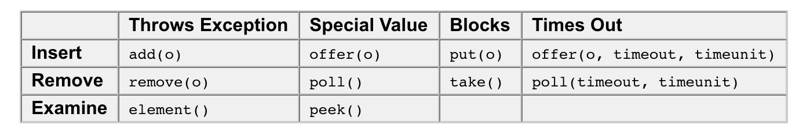
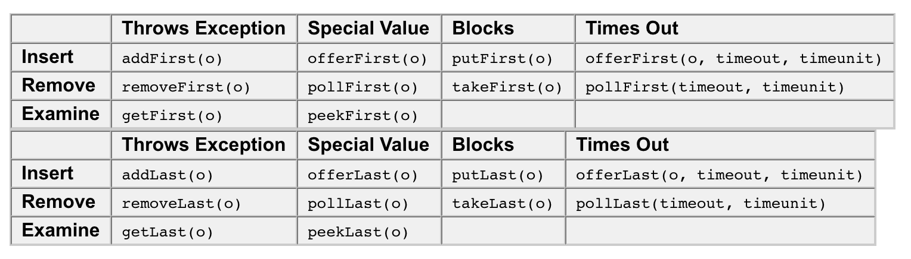
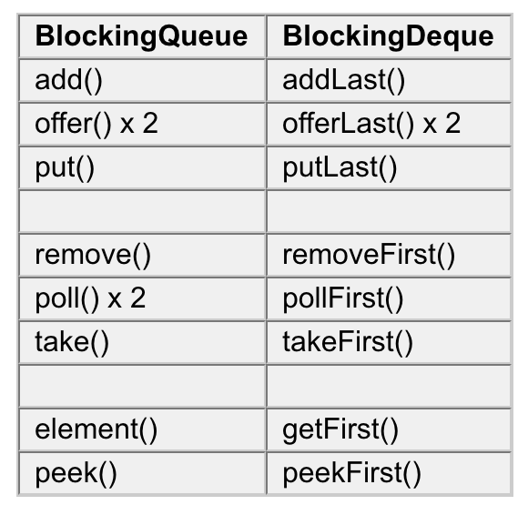
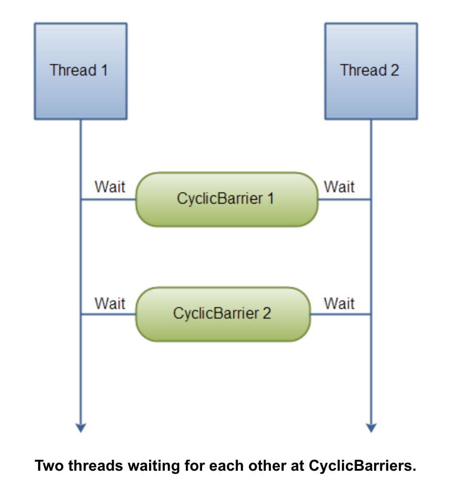
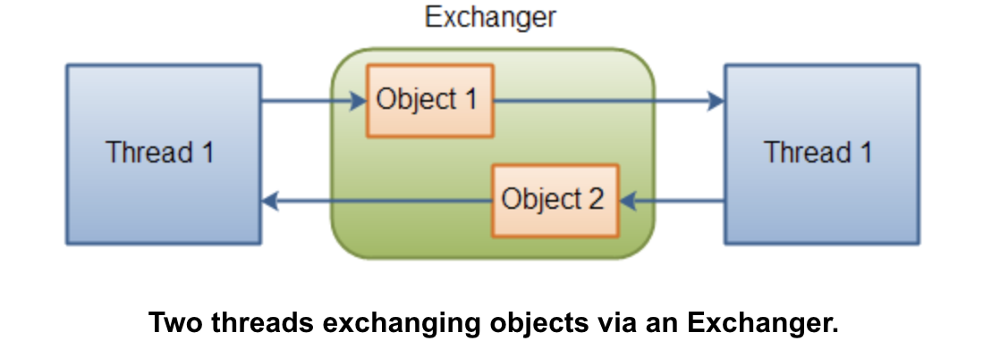

== Java Concurrency Utilities
Java 5 added a new Java package to the Java platform, the java.util.concurrent package.
Java 5 中添加了一个新的并发处理包 *_java.util.concurrent_*。

=== BlockingQueue
A BlockingQueue is typically used to have on thread produce objects, which another thread consumes. Here is a diagram that illustrates this principle:
一个BlockingQueue 的典型用法是一个线程生产对象，另外一个线程去消费对象。

image::images/concurrency-3d96b.png[]

==== BlockingQueue Methods

The 4 different sets of behaviour means this:

* Throws Exception:
If the attempted operation is not possible immediately, an exception is thrown.
* Special Value:
If the attempted operation is not possible immediately, a special value is returned (often true / false).
* Blocks:
If the attempted operation is not possible immedidately, the method call blocks until it is.
Times Out:

If the attempted operation is not possible immedidately, the method call blocks until it is, but waits no longer than the given timeout. Returns a special value telling whether the operation succeeded or not (typically true / false).
It is not possible to insert null into a BlockingQueue. If you try to insert null, the BlockingQueue will throw a NullPointerException.

==== BlockingQueue Implementations

Since BlockingQueue is an interface, you need to use one of its implementations to use it. The java.util.concurrent package has the following implementations of the BlockingQueue interface (in Java 6):

* ArrayBlockingQueue
* DelayQueue
* LinkedBlockingQueue
* PriorityBlockingQueue
* SynchronousQueue

== ArrayBlockingQueue

ArrayBlockingQueue is a bounded, blocking queue that stores the elements internally in an array. That it is bounded means that it cannot store unlimited amounts of elements. There is an upper bound on the number of elements it can store at the same time. You set the upper bound at instantiation time, and after that it cannot be changed.

The ArrayBlockingQueue stores the elements internally in FIFO (First In, First Out) order. The head of the queue is the element which has been in queue the longest time, and the tail of the queue is the element which has been in the queue the shortest time.

== DelayQueue
The DelayQueue blocks the elements internally until a certain delay has expired. The elements must implement the interface

DelayQueue是一个无界阻塞队列，只有在延迟期满时才能从中提取元素。该队列的头部是延迟期满后保存时间最长的Delayed 元素。

java.util.concurrent.Delayed. Here is how the interface looks:
[source,java]

----
public interface Delayed extends Comparable<Delayed< {

 public long getDelay(TimeUnit timeUnit);

}

----

== LinkedBlockingQueue

The LinkedBlockingQueue keeps the elements internally in a linked structure (linked nodes). This linked structure can optionally have an upper bound if desired. If no upper bound is specified, Integer.MAX_VALUE is used as the upper bound.

The LinkedBlockingQueue stores the elements internally in FIFO (First In, First Out) order. The head of the queue is the element which has been in queue the longest time, and the tail of the queue is the element which has been in the queue the shortest time.
[source,java]

----
BlockingQueue<String> unbounded = new LinkedBlockingQueue<String>();
BlockingQueue<String> bounded   = new LinkedBlockingQueue<String>(1024);

bounded.put("Value");

String value = bounded.take();
----
=== PriorityBlockingQueue

The PriorityBlockingQueue is an unbounded concurrent queue. It uses the same ordering rules as the java.util.PriorityQueue class. You cannot insert null into this queue.

优先级队列PriorityBlockingQueue必须是实现Comparable接口，队列通过这个接口的compare方法确定对象的priority。

优先级队列是一个基于堆的无界并发安全的优先级队列。

优先级队列不允许null值，不允许未实现Comparable接口的对象。

_附：compareTo就是比较两个数据的大小关系 大于0表示前一个数据比后一个数据大， 0表示相等，小于0表示第一个数据小于第二个数据。_

比较规则：当前对象和其他对象做比较，当前优先级大就返回-1，优先级小就返回1。

All elements inserted into the PriorityBlockingQueue must implement the java.lang.Comparable interface. The elements thus order themselves according to whatever priority you decide in your Comparable implementation.

Notice that the PriorityBlockingQueue does not enforce any specific behaviour for elements that have equal priority (compare() == 0).

Also notice, that in case you obtain an Iterator from a PriorityBlockingQueue, the Iterator does not guarantee to iterate the elements in priority order.

=== SynchronousQueue

The SynchronousQueue is a queue that can only contain a single element internally. A thread inseting an element into the queue is blocked until another thread takes that element from the queue. Likewise, if a thread tries to take an element and no element is currently present, that thread is blocked until a thread insert an element into the queue.

== BlockingDeque

The BlockingDeque interface in the java.util.concurrent class represents a deque which is thread safe to put into, and take instances from. In this text I will show you how to use this BlockingDeque.

The BlockingDeque class is a Deque which blocks threads tring to insert or remove elements from the deque, in case it is either not possible to insert or remove elements from the deque.

A deque is short for "Double Ended Queue". Thus, a deque is a queue which you can insert and take elements from, from both ends.

=== BlockingDeque Usage
A BlockingDeque could be used if threads are both producing and consuming elements of the same queue. It could also just be used if the producting thread needs to insert at both ends of the queue, and the consuming thread needs to remove from both ends of the queue. Here is an illustration of that:

image::images/concurrency-913d9.png[]

=== BlockingDeque methods

A BlockingDeque has 4 different sets of methods for inserting, removing and examining the elements in the deque. Each set of methods behaves differently in case the requested operation cannot be carried out immediately. Here is a table of the methods:

The 4 different sets of behaviour means this:

* Throws Exception:
If the attempted operation is not possible immediately, an exception is thrown.
* Special Value:
If the attempted operation is not possible immediately, a special value is returned (often true / false).
* Blocks:
If the attempted operation is not possible immedidately, the method call blocks until it is.
* Times Out:
If the attempted operation is not possible immedidately, the method call blocks until it is, but waits no longer than the given timeout. Returns a special value telling whether the operation succeeded or not (typically true / false).

=== BlockingDeque Extends BlockingQueue

The BlockingDeque interface extends the BlockingQueue interface. That means that you can use a BlockingDeque as a BlockingQueue. If you do so, the various inserting methods will add the elements to the end of the deque, and the removing methods will remove the elements from the beginning of the deque. The inserting and removing methods of the BlockingQueue interface, that is.

Here is a table of what the methods of the BlockingQueue does in a BlockingDeque implementation:

== LinkedBlockingDeque

The word Deque comes from the term "Double Ended Queue". A Deque is thus a queue where you can insert and remove elements from both ends of the queue.

The LinkedBlockingDeque is a Deque which will block if a thread attempts to take elements out of it while it is empty, regardless of what end the thread is attempting to take elements from.

Here is how to instantiate and use a LinkedBlockingDeque:

[source,java]
----
BlockingDeque<String> deque = new LinkedBlockingDeque<String>();

deque.addFirst("1");
deque.addLast("2");

String two = deque.takeLast();
String one = deque.takeFirst();
----

== ConcurrentMap

The ConcurrentHashMap is very similar to the java.util.HashTable class, except that ConcurrentHashMap offers better concurrency than HashTable does. ConcurrentHashMap does not lock the Map while you are reading from it. Additionally, ConcurrentHashMap does not lock the entire Map when writing to it. It only locks the part of the Map that is being written to, internally.

== ConcurrentNavigableMap

The java.util.concurrent.ConcurrentNavigableMap class is a java.util.NavigableMap with support for concurrent access, and which has concurrent access enabled for its submaps. The "submaps" are the maps returned by various methods like headMap(), subMap() and tailMap().

=== headMap()

The headMap(T toKey) method returns a view of the map containing the keys which are strictly less than the given key.

If you make changes to the original map, these changes are reflected in the head map.

Here is an example illustrating the use of the headMap() method.

[source,java]
----
ConcurrentNavigableMap map = new ConcurrentSkipListMap();

map.put("1", "one");
map.put("2", "two");
map.put("3", "three");

ConcurrentNavigableMap headMap = map.headMap("2");
----
The headMap will point to a ConcurrentNavigableMap which only contains the key "1", since only this key is strictly less than "2".

=== tailMap

The tailMap(T fromKey) method returns a view of the map containing the keys which are greater than or equal to the given fromKey.

If you make changes to the original map, these changes are reflected in the tail map.

Here is an example illustrating the use of the tailMap() method:

[source,java]
----
ConcurrentNavigableMap map = new ConcurrentSkipListMap();

map.put("1", "one");
map.put("2", "two");
map.put("3", "three");

ConcurrentNavigableMap tailMap = map.tailMap("2");
----
The tailMap will contain the keys "2" and "3" because these two keys are greather than or equal to the given key, "2

=== subMap()

The subMap() method returns a view of the original map which contains all keys from (including), to (excluding) two keys given as parameters to the method. Here is an example:
[source,java]
----
ConcurrentNavigableMap map = new ConcurrentSkipListMap();

map.put("1", "one");
map.put("2", "two");
map.put("3", "three");

ConcurrentNavigableMap subMap = map.subMap("2", "3");
----
The returned submap contains only the key "2", because only this key is greater than or equal to "2", and smaller than "3".

=== More Methods

* descendingKeySet()
* descendingMap()
* navigableKeySet()

== CountDownLatch

A java.util.concurrent.CountDownLatch is a concurrency construct that allows one or more threads to wait for a given set of operations to complete.

A CountDownLatch is initialized with a given count. This count is decremented by calls to the countDown() method. Threads waiting for this count to reach zero can call one of the await() methods. Calling await() blocks the thread until the count reaches zero.

Below is a simple example. After the Decrementer has called countDown() 3 times on the CountDownLatch, the waiting Waiter is released from the await() call.

== CyclicBarrier

CyclicBarrier 的字面意思是可循环使用（Cyclic）的屏障（Barrier）。它要做的事情是，让一组线程到达一个屏障（也可以叫同步点）时被阻塞，直到最后一个线程到达屏障时，屏障才会开门，所有被屏障拦截的线程才会继续干活。CyclicBarrier默认的构造方法是CyclicBarrier(int parties)，其参数表示屏障拦截的线程数量，每个线程调用await方法告诉CyclicBarrier我已经到达了屏障，然后当前线程被阻塞。

----
//parties表示屏障拦截的线程数量，当屏障撤销时，先执行barrierAction，然后在释放所有线程
public CyclicBarrier(int parties, Runnable barrierAction)
//barrierAction默认为null
public CyclicBarrier(int parties)

/*
 *当前线程等待直到所有线程都调用了该屏障的await()方法
 *如果当前线程不是将到达的最后一个线程，将会被阻塞。解除阻塞的情况有以下几种
     1）最后一个线程调用await()
     2）当前线程被中断
     3）其他正在该CyclicBarrier上等待的线程被中断
     4）其他正在该CyclicBarrier上等待的线程超时
     5）其他某个线程调用该CyclicBarrier的reset()方法
 *如果当前线程在进入此方法时已经设置了该线程的中断状态或者在等待时被中断，将抛出InterruptedException，并且清除当前线程的已中断状态。
 *如果在线程处于等待状态时barrier被reset()或者在调用await()时 barrier 被损坏，将抛出 BrokenBarrierException 异常。
 *如果任何线程在等待时被中断，则其他所有等待线程都将抛出 BrokenBarrierException 异常，并将 barrier 置于损坏状态。 *如果当前线程是最后一个将要到达的线程，并且构造方法中提供了一个非空的屏障操作（barrierAction），那么在允许其他线程继续运行之前，当前线程将运行该操作。如果在执行屏障操作过程中发生异常，则该异常将传播到当前线程中，并将 barrier 置于损坏状态。
 *
 *返回值为当前线程的索引，0表示当前线程是最后一个到达的线程
 */
public int await() throws InterruptedException, BrokenBarrierException
//在await()的基础上增加超时机制，如果超出指定的等待时间，则抛出 TimeoutException 异常。如果该时间小于等于零，则此方法根本不会等待。
public int await(long timeout, TimeUnit unit) throws InterruptedException, BrokenBarrierException, TimeoutException

//将屏障重置为其初始状态。如果所有参与者目前都在屏障处等待，则它们将返回，同时抛出一个BrokenBarrierException。
public void reset()
----

　　对于失败的同步尝试，CyclicBarrier 使用了一种要么全部要么全不 (all-or-none) 的破坏模式：如果因为中断、失败或者超时等原因，导致线程过早地离开了屏障点，那么在该屏障点等待的其他所有线程也将通过 BrokenBarrierException（如果它们几乎同时被中断，则用 InterruptedException）以反常的方式离开。

== 14、Exchanger

The java.util.concurrent.Exchanger class represents a kind of rendezvous point where two threads can exchange objects. Here is an illustration of this mechanism:

== 15、Semaphore(信号量)
