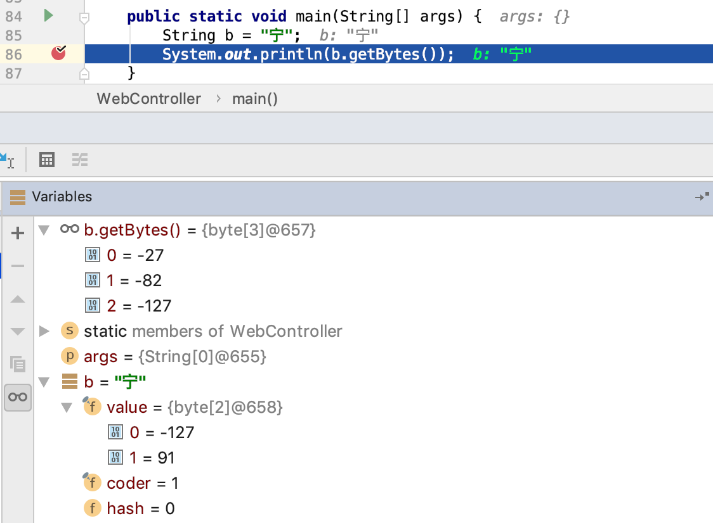

Java中的字符串是怎么存储的,通过断点可以查看到是一个

----
String a = "宁"；
byte[2]{-127，91}
----
那我们看一下通过a.getBytes();方法后得到的byte数组是多少？
----
a.getBytes();
byte[3]{-27,-82,-127}
----
我们知道Java中的字符是Unicode字符集，那“宁”的Unicode字符对应的编码是什么？
----
\u5b81
----
那他们之间是怎么转换的呢？
先看一下UTF-8编码的编码规则（Unicode是字符集不是编码方式）

UTF-8是一种变长字节编码方式。对于某一个字符的UTF-8编码，如果只有一个字节则其最高二进制位为0；如果是多字节，其第一个字节从最高位开始，连续的二进制位值为1的个数决定了其编码的位数，其余各字节均以10开头。UTF-8最多可用到6个字节。
如表：

* 1字节 0000~007F           0xxxxxxx
* 2字节 0080~07FF           110xxxxx_10xxxxxx
* 3字节 0800~FFFF           1110xxxx_10xxxxxx_10xxxxxx
* 4字节 1 0000~1F FFFF      11110xxx_10xxxxxx_10xxxxxx_10xxxxxx
* 5字节 20 0000~3FF FFFF    111110xx_10xxxxxx_10xxxxxx_10xxxxxx_10xxxxxx
* 6字节 400 0000~7FFF FFFF  1111110x_10xxxxxx_10xxxxxx_10xxxxxx_10xxxxxx_10xxxxxx

因此UTF-8中可以用来表示字符编码的实际位数最多有31位，即上表中x所表示的位。除去那些控制位（每字节开头的10等），这些x表示的位与UNICODE编码是一一对应的，位高低顺序也相同。

----
5b81                首先将\u5b81转换为二进制：
01011011_10000001   转换后为两字节
91 -127             转换为二进制是
因为是从低位到高位进行编码，所以得到内存中的byte[2]{-127,91}

1110xxxx_10xxxxxx_10xxxxxx 将以上二进制转换为UTF-8编码

    0101   101110   000001 按规则拆分
1110xxxx_10xxxxxx_10xxxxxx 合并得到以下

11100101_10101110_10000001 转换为byte
-        -        -        取符号
00011010_01010001_01111110 按位取反
26       81       126      转为十进制
27       82       127      负数+1

-27     -82       -127     得到结果

所以得到getByte()得到的是{-27,-82,-127}因为UTF-8是顺序编码，所以和上面的byte数组顺序是相反的。
----
* 正数的最高位都是 0 ，正数的值就是二进制表示的值。

* 负数的最高位都是 1 ，负数的值是 取反后加一 然后加个负号得到得值。

因此得到了汉字在Java内存中是如何存储的和如何进行编码传输的。
