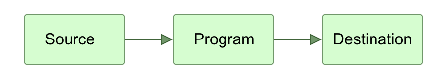
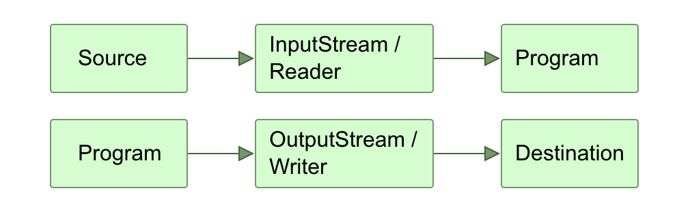
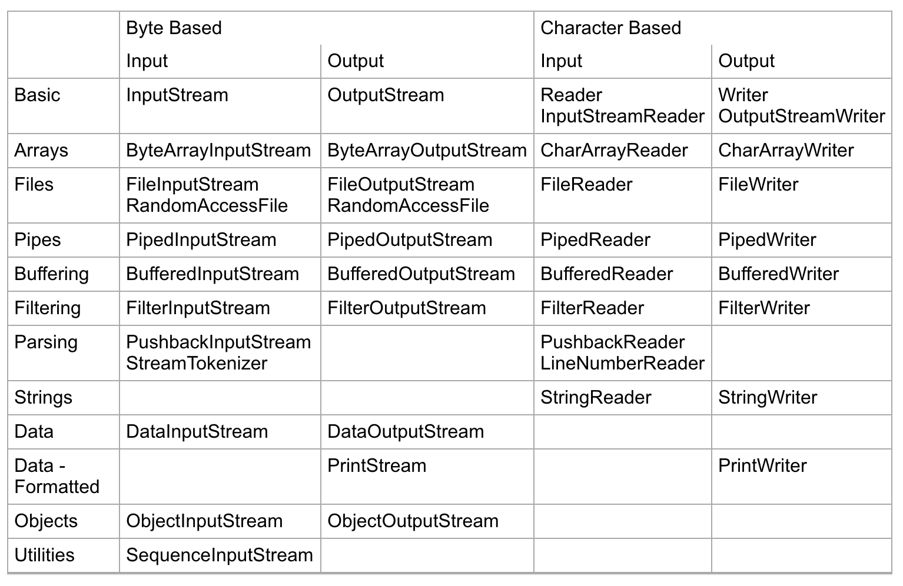

= Java IO

== Java IO Tutorial

Java IO 是用于处理读取数据和输出数据的API。很多应用需要处理输入数据和基于输入数据做一些处理，例如通过网络读取一个文件的数据，或者将数据写回到网络。

Java IO API在java.io包中，但并没有包含多有的input和output，比如GUI的输入和输出或者web page的输出。那些输出在另外的地方，比如JFC class用户Swing项目，Servlet或HTTP在javaEE中。

Java NIO 是一个和IO有大多数功能相同的类，只不过JavaNIO 是一个non-blocking mode，在相同情况下，有着比blocking IO更好的表现。另外还有一些其他IO包同样用与理Streams，iterating streams。

The tutorial starts by giving you a solid overview of how the Java IO APIs work, and how you are supposed to use them. After that the tutorial switches to covering the core classes in the Java IO API.

The coverage of the classes in this tutorial is not just an API listing. It's more than just a class listing (you can get that from Sun's official Java Doc's). Rather each text is a short introduction to the class, its purpose, and a few examples of how to use it. In other words, some of the stuff you don't find in Sun's official Java Doc's.

== Java IO Overview

=== Input and Output - Source and Destination

Java's IO package mostly concerns itself with the reading of raw data from a source and writing of raw data to a destination. The most typical sources and destinations of data are these:

* Files
* Pipes
* Network Connections
* In-memory Buffers (e.g. arrays)
* System.in, System.out, System.error

=== Streams

IO Streams are a core concept in Java IO. A stream is a conceptually endless flow of data. You can either read from a stream or write to a stream. A stream is connected to a data source or a data destination. Streams in Java IO can be either byte based (reading and writing bytes) or character based (reading and writing characters).

=== The InputStream, OutputStream, Reader and Writer
A program that needs to read data from some source needs an InputStream or a Reader. A program that needs to write data to some destination needs an OutputStream or a Writer. This is also illustrated in the diagram below:

=== Java IO Purposes and Features
Java IO contains many subclasses of the _InputStream_, _OutputStream_, _Reader_ and _Writer_ classes.

* File Access  文件获取
* Network Access 网络获取
* Internal Memory Buffer Access 直接内存Buffer获取
* Inter-Thread Communication (Pipes) 内存线程交流
* Buffering
* Filtering
* Parsing
* Reading and Writing Text (Readers / Writers) 文本
* Reading and Writing Primitive Data (long, int etc.) 原始类型
* Reading and Writing Objects 对象类型

=== Java IO Class Overview Table

== Files

=== Reading Files
If you need to read a file from one end to the other you can use a FileInputStream or a FileReader depending on whether you want to read the file as binary or textual data. These two classes lets you read a file one byte or character at a time from the start to the end of the file, or read the bytes into an array of byte or char, again from start towards the end of the file. You don't have to read the whole file, but you can only read bytes and chars in the sequence they are stored in the file.

If you need to jump around the file and read only parts of it from here and there, you can use a RandomAccessFile.

=== Writing File
If you need to write a file from one end to the other you can use a FileOutputStream or a FileWriter depending on whether you need to write binary data or characters. You can write a byte or character at a time from the beginning to the end of the file, or write arrays of byte and char. Data is stored sequentially in the file in the order they are written.

If you need to skip around a file and write to it in various places, for instance appending to the end of the file, you can use a RandomAccessFile.

=== Random Access to Files

As I have already mentioned, you can get random access to files with Java IO via the RandomAccessFile class.

Random access doesn't mean that you read or write from truly random places. It just means that you can skip around the file and read from or write to it at the same time in any way you want. No particular access sequence is enforced. This makes it possible to overwrite parts of an existing file, to append to it, delete from it, and of course read from the file from wherever you need to read from it.

你可以读取或者写入在相同的时间，任何方法写入。
=== File and Directory Info Access

Sometimes you may need access to information about a file rather than its content. For instance, if you need to know the file size or the file attributes of a file. The same may be true for a directory. For instance, you may want to get a list of all files in a given directory. Both file and directory information is available via the File class.

[source,java]

----
package com.ny.example.io;

import java.io.IOException;
import java.io.PipedInputStream;
import java.io.PipedOutputStream;

public class PipeExample {
    public static void main(String[] args) throws IOException {
        final PipedOutputStream outputStream = new PipedOutputStream();
        final PipedInputStream inputStream = new PipedInputStream();
        outputStream.connect(inputStream);
        Thread thread1 = new Thread(() -> {
            try {
                outputStream.write("hello world,pipe!".getBytes());
            }catch (IOException e){
                e.printStackTrace();
            }
        });
        Thread thread2 = new Thread(() -> {
            try {
                int data = inputStream.read();
                while (data!=-1){
                    System.out.println((char)data);
                    data = inputStream.read();
                }
            }catch (IOException e){
                e.printStackTrace();
            }
        });
        thread1.start();
        thread2.start();
    }
}
----

=== Pipes and Threads

pipe connect 后，两个线程的调用是阻塞的，也就是说，read和write是阻塞的，很容造成死锁。

=== Pipe Alternatives（的可选择性）
有其他方法进行线程之间的通信，但是简单的byte数据，通过这种方式是可行的。
